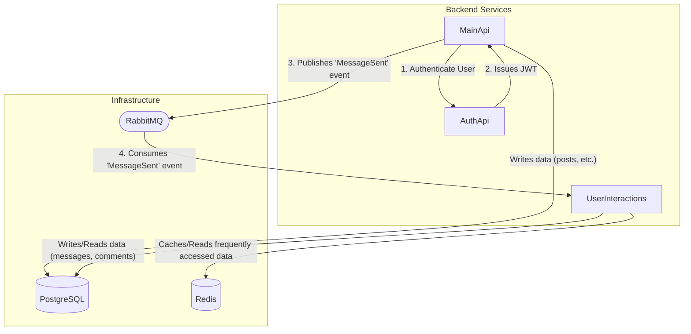

# ASP.NET Microservices Project

This project is a simple microservices-based (unfinished) project developed using .NET, designed to handle social interactions like posts, comments, and private messaging. The system is composed of three distinct, containerized services that communicate both synchronously and asynchronously to provide a scalable and maintainable backend.

## System Architecture

The application is divided into three main services, each with specific tasks. They are supported by a common infrastructure layer that includes a database, a message broker, and a cache.

### Service Roles:
- AuthApi: The dedicated identity provider. Its sole responsibility is to manage user accounts (registration, login) and issue signed JWTs for secure authentication. It holds the private key for signing tokens.
- MainApi: The primary gateway for write-heavy operations. It handles requests for creating posts, adding comments, and sending messages. It validates tokens with AuthApi and publishes events to the message broker for asynchronous processing.
- UserInteractions: A specialized service for read-heavy operations. It listens for events from the message broker (like new messages or comments), processes them, and exposes endpoints for clients to fetch conversation histories and comment threads.

### Core Features
- JWT-based Authentication: Secure user registration and login flow.
- Post & Comment Management: Functionality to create and view posts and comments.
- Private Messaging: Users can send and receive private messages.
- Asynchronous Communication: Uses a message broker (RabbitMQ) to decouple services and handle tasks reliably.
- Containerized: Fully containerized with Docker for consistent development and deployment environments.

### Technology Stack
- Framework: .NET 8 / ASP.NET Core
- API Frameworks: FastEndpoints, MediatR
- Data Access: Entity Framework Core
- Database: PostgreSQL
- Message Broker: MassTransit with RabbitMQ
- Caching: Redis
- Containerization: Docker & Docker Compose
- Validation: FluentValidation

### Getting Started:
The entire environment is orchestrated with Docker Compose, making it simple to get up and running.Prerequisites
- .NET 8 SDK
- Docker Desktop
  
### Configuration:
This project uses .env files at the solution root for configuration, especially for secrets.
First, create a file named .env in the root directory of the repository. Then, copy the contents of .env.example (if provided) or use the template below.
File: .env
    <pre>AUTHAPI_JWT_PRIVATEKEY=privatekey </pre>
